# Data Model — Breathe ESG Platform

## Overview

The database schema is designed around five core models organized in a dependency hierarchy that supports multi-tenancy, immutable raw storage, and a complete audit trail.

## Entity-Relationship Diagram

```mermaid
erDiagram
    Organization {
        int id PK
        string name
        string slug
        datetime created_at
    }

    IngestionLog {
        int id PK
        int organization_id FK
        string source
        int scope
        string status
        string raw_file
        int record_count
        int error_count
        json error_details
        int created_by_id FK
        datetime created_at
        datetime completed_at
    }

    RawRecord {
        int id PK
        int ingestion_log_id FK
        string source_type
        json raw_json
        int row_index
        datetime created_at
    }

    ActivityRecord {
        int id PK
        int raw_record_id FK
        int organization_id FK
        int scope
        string source_type
        date activity_date
        float quantity
        string unit
        float emission_factor
        float co2e_kg
        string location
        string department
        string cost_center
        string supplier
        string description
        string status
        string flag_reason
        datetime created_at
        datetime updated_at
    }

    AuditLog {
        int id PK
        int activity_record_id FK
        int changed_by_id FK
        datetime changed_at
        string action
        string field_name
        string old_value
        string new_value
        string note
    }

    Organization ||--o{ IngestionLog : "owns"
    Organization ||--o{ ActivityRecord : "owns"
    IngestionLog ||--o{ RawRecord : "contains"
    RawRecord ||--|| ActivityRecord : "normalizes to"
    ActivityRecord ||--o{ AuditLog : "tracked by"
```



## Model Descriptions

### `Organization`
Multi-tenant root. Every ingestion and record belongs to an organization, enabling future isolation between client accounts.

### `IngestionLog`
Tracks every import attempt from all three source types.

| Field | Type | Notes |
|---|---|---|
| `source` | Enum | SAP / UTILITY / TRAVEL |
| `scope` | Int | 1, 2, or 3 |
| `status` | Enum | PENDING → SUCCESS / FAILED / PARTIAL |
| `raw_file` | FileField | Stored upload (CSV files) |
| `record_count` | Int | Successfully created records |
| `error_count` | Int | Records that failed normalization |
| `error_details` | JSONField | List of error messages |

### `RawRecord`
**Immutable** — stores the exact source data as JSON. This is the ground truth and cannot be edited through the API. Ensures full reproducibility.

### `ActivityRecord`
The normalized, emission-ready record. All quantities are in standard units:
- Fuel → **Litres (L)**
- Electricity → **kWh**
- Flights → **passenger-km**
- Hotel stays → **nights**

The `co2e_kg` field is always recomputed on save (`quantity × emission_factor`).

**Status lifecycle:**
```
PENDING → FLAGGED (analyst flags an issue)
PENDING → APPROVED (analyst approves)
APPROVED → LOCKED (automatic after approval; read-only)
```

### `AuditLog`
Immutable record of every state change. Actions tracked:
- `CREATE` — record first imported
- `EDIT` — field changed via analyst desk (captures old/new value per field)
- `FLAG` — record flagged with a reason
- `APPROVE` — record approved
- `LOCK` — record locked from further edits

## Audit Trail Design

The audit trail is append-only. When an analyst edits a record via `PATCH /api/records/{id}/`, the view:
1. Iterates over each field in the submitted data
2. Compares to the current value
3. Creates one `AuditLog` entry per changed field (with `old_value` and `new_value`)

This gives a field-level change history, enabling precise compliance reporting.

## Design Decisions

- **RawRecord is OneToOne with ActivityRecord** — every normalized record has exactly one raw source counterpart.
- **co2e_kg is computed, not stored separately** — it's always recalculated on `ActivityRecord.save()` to prevent stale values.
- **SQLite for development** — zero setup, portable `db.sqlite3` file. Can be swapped for PostgreSQL in production by changing `DATABASES` in `settings.py`.
